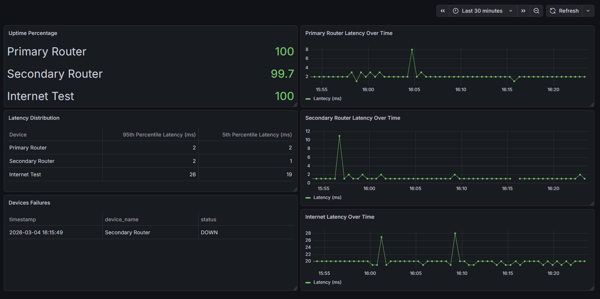

# Home Network Monitoring System

## Overview
The goal of this project is to monitor different routers in the local network, recording metrics such as latency and availability.
The objective is to creat historic data to analyse the performance of the network and detect possible breakdowns.

## Technologies
- Python (monitoring and analysis)
- ICMP/Ping
- PostgreSQL (database)
- Grafana (Dashboard)

## Devices Monitored
- Primary Router
- Secondary Router
- 8.8.8.8 (internet connectivity test)


# Phase 1 – Basic Network Monitoring

## Objective
Create a Python script to monitor devices in the local network, collect latency and availability data, and store it in a CSV file.

## Architecture


### Flow Description
- `monitor.py` controls the monitoring loop  
- `ping.py` handles the ICMP requests and latency parsing  
- `storage.py` writes the collected data into a CSV file  
- Data is stored in `metrics.csv` for historical tracking  

## Implementation
- **`ping.py`** – Function `ping_device(ip)` pings a device and returns:
  - Timestamp
  - Latency (ms)
  - Status (`UP` / `DOWN`)
- **`storage.py`** – Function `write_csv(file_path, data)` writes results to CSV, creating the file with header if it does not exist
- **`monitor.py`** – Loops through devices, calls `ping_device()`, writes results to CSV, and prints output to terminal

## Results

### CSV File Example


### Terminal Output Example


## Challenges & Notes
- Latency extraction works for both English and Portuguese Windows ping output   
- A latency value of 0ms may occur in extremely fast local networks but may also indicate parsing issues. If incorrectly interpreted as `DOWN`, this could generate false alerts. Future versions may include stricter validation logic.

## How To Run (Version 1)

1. Go to the `src` folder  
2. Check that the IP addresses in `monitor.py` match your local network  
3. Run the monitoring script: python monitor.py
4. The CSV file will be created at data/metrics.csv and results will be printed in the terminal
5. Stop monitoring anytime with Ctrl+C.


# Phase 2 – Database Integration (PostgreSQL)

## Objective
Upgrade the monitoring system by replacing CSV storage with a PostgreSQL database to enable structured data persistence, advanced querying, and future dashboard integration.

## Architecture


### Flow Description
- `monitor.py` controls the monitoring loop  
- `ping.py` handles the ICMP requests and latency parsing  
- `database.py` manages the PostgreSQL connection and inserts data  
- Data is stored in the `metrics` table inside the PostgreSQL database for persistent historical tracking  

## Implementation
- **`ping.py`** – Function `ping_device(ip)` pings a device and returns:
  - Timestamp  
  - Latency (ms)  
  - Status (`UP` / `DOWN`)  
- **`database.py`** – Contains the `Database` class:
  - `__init__()` establishes connection to PostgreSQL  
  - `insert_metric(timestamp, device, latency, status)` inserts monitoring records into the `metrics` table  
  - `close()` safely closes the database connection  
- **`monitor.py`** – Updated monitoring loop:
  - Creates a `Database` object  
  - Calls `insert_metric()` instead of writing to CSV  
  - Maintains continuous monitoring and prints output to terminal  
 
## Results

### Database Table Example


### Terminal Output Example


## Challenges & Notes
- Required correct PostgreSQL authentication and configuration  
- Ensured timestamps are properly stored using `TIMESTAMP` type for time-series analysis   

## How To Run (Version 2)

1. Install PostgreSQL  
2. Create a database named `network_monitor`  
3. Create the table:

```sql
CREATE TABLE metrics (
    id SERIAL PRIMARY KEY,
    timestamp TIMESTAMP NOT NULL,
    device_name VARCHAR(100) NOT NULL,
    latency_ms INTEGER,
    status VARCHAR(10) NOT NULL CHECK (status IN ('UP', 'DOWN'))
); 
```
4. Go to the `src` folder
5. Check that the IP addresses in `monitor.py` match your local network
3. Run the monitoring script: python monitor.py
6. Update PostgreSQL credentials inside database.py if needed


# Phase 3 – Network Visualization with Grafana

## Objective
Enhance the monitoring system by adding real-time data visualization using Grafana.

This phase builds directly on Phase 2.  
The data collection and database architecture remain unchanged.

The goal of this phase is to transform raw monitoring data into meaningful performance insights.

## Dashboard Example



## Dashboard Overview

Grafana connects directly to the PostgreSQL `metrics` table and executes custom SQL queries to generate real-time panels.

### Main Panels

### 1. Uptime Percentage
Displays availability percentage per device.

- Quick health overview
- Based on ratio of `UP` vs total checks

### 2. Latency Over Time
Time-series graphs for:
- Primary Router
- Secondary Router
- Internet Test

Allows:
- Detection of spikes
- Trend analysis
- Stability comparison

### 3. Latency Distribution (P95 / P05)

Instead of using maximum latency, the system calculates:

- 95th percentile latency (P95)
- 5th percentile latency (P05)

This avoids distortion from isolated spikes and provides a statistically representative performance metric.

Example query:

```sql
SELECT
  device_name AS "Device",
  percentile_cont(0.95) WITHIN GROUP (ORDER BY latency_ms) AS "95th Percentile Latency (ms)",
  percentile_cont(0.05) WITHIN GROUP (ORDER BY latency_ms) AS "5th Percentile Latency (ms)"
FROM metrics
WHERE latency_ms IS NOT NULL
GROUP BY device_name
ORDER BY
  CASE
    WHEN device_name = 'Primary Router' THEN 1
    WHEN device_name = 'Secondary Router' THEN 2
    WHEN device_name = 'Internet Test' THEN 3
    ELSE 4
```

### 4. Device Failures Table
Displays historical `DOWN` events.

Enables:
- Incident tracking
- Instability detection
- Correlation with latency spikes

## Technical Improvements Introduced

- Use of statistical percentiles instead of raw maximum values
- Real-time SQL-driven visualization
- Cleaner interpretation of network behaviour

## Conclusion

Phase 3 completes the monitoring pipeline:

Data Collection → Storage → Visualization → Insight

The system now provides:

- Real-time monitoring
- Historical performance tracking
- Statistical latency evaluation
- Failure logging

This phase elevates the project from a data logger to a complete monitoring solution.