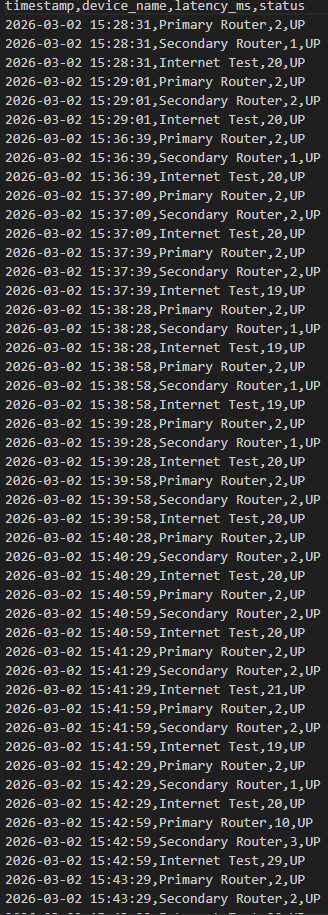
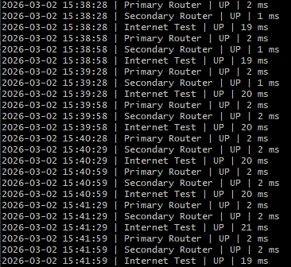
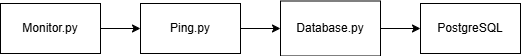
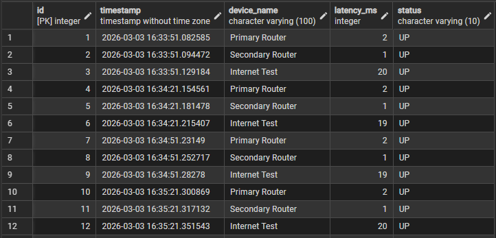
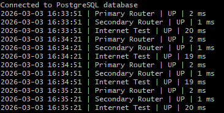

# Home Network Monitoring System

## Overview
The goal of this project is to monitor different routers in the local network, recording metrics such as latency and availability.
The objective is to creat historic data to analyse the performance of the network and detect possible breakdowns.

## Technologies
- Python (monitoring and analysis)
- ICMP/Ping
- PostgreSQL (database)
- Grafana (Dashboard)

## Devices Monitored
- Primary Router
- Secondary Router
- 8.8.8.8 (internet connectivity test)


# Phase 1 – Basic Network Monitoring

## Objective
Create a Python script to monitor devices in the local network, collect latency and availability data, and store it in a CSV file.

## Architecture


### Flow Description
- `monitor.py` controls the monitoring loop  
- `ping.py` handles the ICMP requests and latency parsing  
- `storage.py` writes the collected data into a CSV file  
- Data is stored in `metrics.csv` for historical tracking  

## Implementation
- **`ping.py`** – Function `ping_device(ip)` pings a device and returns:
  - Timestamp
  - Latency (ms)
  - Status (`UP` / `DOWN`)
- **`storage.py`** – Function `write_csv(file_path, data)` writes results to CSV, creating the file with header if it does not exist
- **`monitor.py`** – Loops through devices, calls `ping_device()`, writes results to CSV, and prints output to terminal

## Results

### CSV File Example


### Terminal Output Example


## Challenges & Notes
- Latency extraction works for both English and Portuguese Windows ping output   
- A latency value of 0ms may occur in extremely fast local networks but may also indicate parsing issues. If incorrectly interpreted as `DOWN`, this could generate false alerts. Future versions may include stricter validation logic.

## How To Run (Version 1)

1. Go to the `src` folder  
2. Check that the IP addresses in `monitor.py` match your local network  
3. Run the monitoring script: python monitor.py
4. The CSV file will be created at data/metrics.csv and results will be printed in the terminal
5. Stop monitoring anytime with Ctrl+C.


# Phase 2 – Database Integration (PostgreSQL)

## Objective
Upgrade the monitoring system by replacing CSV storage with a PostgreSQL database to enable structured data persistence, advanced querying, and future dashboard integration.

## Architecture



### Flow Description
- `monitor.py` controls the monitoring loop  
- `ping.py` handles the ICMP requests and latency parsing  
- `database.py` manages the PostgreSQL connection and inserts data  
- Data is stored in the `metrics` table inside the PostgreSQL database for persistent historical tracking  

## Implementation
- **`ping.py`** – Function `ping_device(ip)` pings a device and returns:
  - Timestamp  
  - Latency (ms)  
  - Status (`UP` / `DOWN`)  
- **`database.py`** – Contains the `Database` class:
  - `__init__()` establishes connection to PostgreSQL  
  - `insert_metric(timestamp, device, latency, status)` inserts monitoring records into the `metrics` table  
  - `close()` safely closes the database connection  
- **`monitor.py`** – Updated monitoring loop:
  - Creates a `Database` object  
  - Calls `insert_metric()` instead of writing to CSV  
  - Maintains continuous monitoring and prints output to terminal  
 
## Results

### Database Table Example


### Terminal Output Example


## Challenges & Notes
- Required correct PostgreSQL authentication and configuration  
- Ensured timestamps are properly stored using `TIMESTAMP` type for time-series analysis   

## How To Run (Version 2)

1. Install PostgreSQL  
2. Create a database named `network_monitor`  
3. Create the table:

```sql
CREATE TABLE metrics (
    id SERIAL PRIMARY KEY,
    timestamp TIMESTAMP NOT NULL,
    device_name VARCHAR(100) NOT NULL,
    latency_ms INTEGER,
    status VARCHAR(10) NOT NULL CHECK (status IN ('UP', 'DOWN'))
); 
```
4. Go to the `src` folder
5. Check that the IP addresses in `monitor.py` match your local network
3. Run the monitoring script: python monitor.py
6. Update PostgreSQL credentials inside database.py if needed